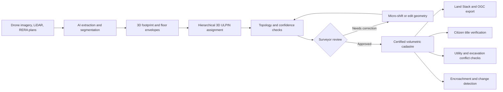
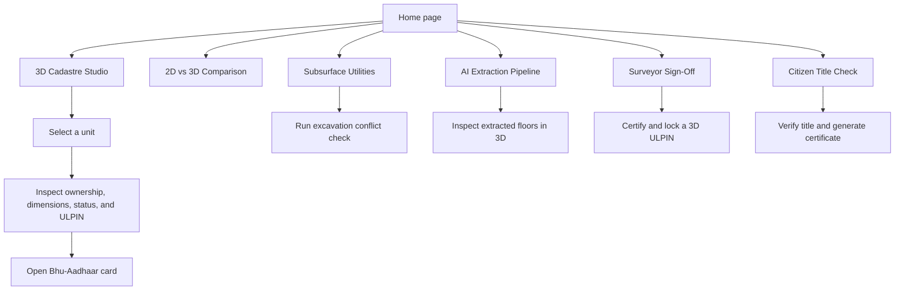
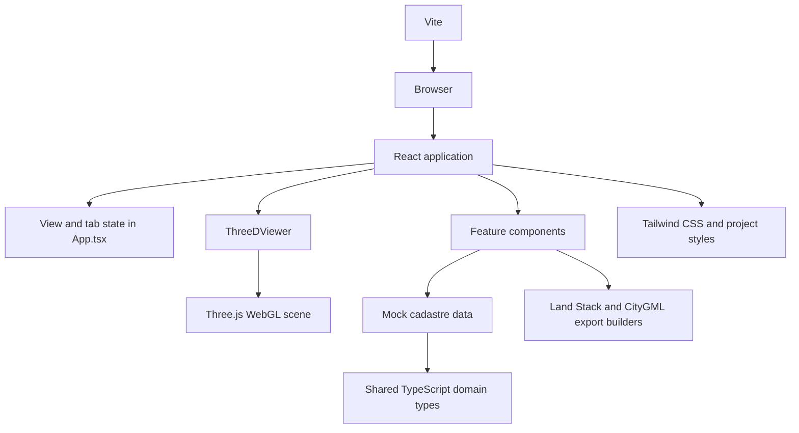
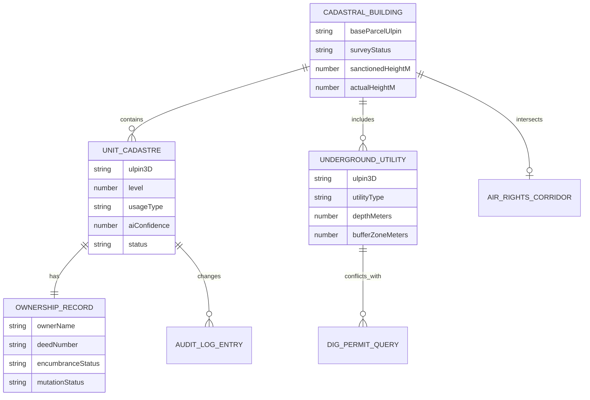
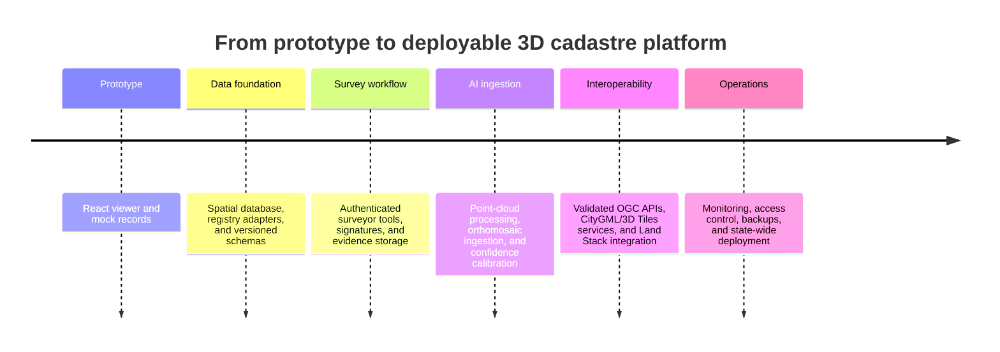

# Bhu-Drishti 3D: ULPIN and Vertical Cadastre

Bhu-Drishti 3D is an interactive prototype for extending India’s parcel-based ULPIN model into a volumetric, three-dimensional cadastre. It demonstrates how a single base parcel can be decomposed into legally meaningful 3D units such as apartments, commercial spaces, parking bays, underground utility corridors, and air-rights corridors.

The project is based on the 3D ULPIN problem statement in `3D ULPIN.pdf`. Its central idea is to retain the existing 14-digit parcel identifier and append a machine-readable spatial suffix. For example:

```text
14010500201088-FL14-U1402
└──────────────┘ └───────┘
 base parcel     floor and unit
```

## Why this project exists

Traditional 2D cadastre records the ground footprint of a property, but it does not describe ownership and restrictions clearly when multiple properties share the same footprint at different elevations. That limitation affects vertical property registration, construction enforcement, excavation permits, infrastructure coordination, and citizen title verification.

This prototype presents a common 3D spatial record that connects geometry, ownership, registration status, survey confidence, encumbrances, and audit history.

## What the prototype demonstrates

- Interactive Three.js visualization of stacked floors, basements, units, utilities, and air rights.
- 2D parcel versus 3D volumetric cadastre comparison.
- Multiple inspection modes: usage, title status, change detection, and AI confidence.
- Floor isolation and exploded building views for vertical inspection.
- Detection of unauthorized floors and sanctioned-height deviations.
- Underground utility inventory with excavation conflict checks and safety buffers.
- Simulated AI extraction pipeline using drone imagery, LiDAR, and scanned plans.
- Surveyor and Tehsildar governance workflow with confidence review, edits, sign-off, and audit history.
- Citizen search by 3D ULPIN, flat number, or owner name.
- Printable 3D Bhu-Aadhaar-style title verification card.
- Downloadable Land Stack JSON and CityGML-style export payloads.
- Jury defense and state adoption playbook for the referenced problem statement.

## Application flow



## Main user journeys



## Technical architecture



### Stack

| Area | Technology |
| --- | --- |
| UI | React 19, TypeScript |
| Build and development | Vite 6 |
| 3D rendering | Three.js |
| Styling | Tailwind CSS 4 and `src/index.css` |
| Icons | Lucide React |
| Animation | Motion |
| Data | TypeScript mock data in `src/data/mockCadastreData.ts` |
| Export formats | Land Stack JSON, GeoJSON-compatible payload, CityGML-style XML |

## Repository structure

```text
.
├── public/                         Static assets and logo
├── src/
│   ├── App.tsx                     Application shell and navigation state
│   ├── types.ts                    Cadastre, ownership, utility, and audit models
│   ├── data/mockCadastreData.ts    Demo buildings, units, utilities, and audit records
│   ├── components/
│   │   ├── ThreeDViewer.tsx        Interactive Three.js scene
│   │   ├── AiExtractionPipeline.tsx
│   │   ├── CadastreSplitView.tsx
│   │   ├── UndergroundUtilityModule.tsx
│   │   ├── SurveyorGovernancePortal.tsx
│   │   ├── CitizenSearchPortal.tsx
│   │   └── LandStackExportModal.tsx
│   └── index.css                   Global styles and visual system
├── 3D ULPIN.pdf                    Source problem statement
├── metadata.json                   Application metadata
├── package.json                    Scripts and dependencies
└── vite.config.ts                  Vite configuration
```

## Getting started

### Requirements

- Node.js 18 or newer
- npm, Bun, or another compatible Node package manager
- A modern browser with WebGL support

### Install dependencies

```bash
npm install
```

The repository also contains `bun.lock`, so Bun can be used instead:

```bash
bun install
```

### Start the development server

```bash
npm run dev
```

Open `http://localhost:3000` in a browser.

With Bun:

```bash
bun run dev
```

### Validate and build

```bash
npm run lint
npm run build
```

To preview the production build:

```bash
npm run preview
```

## Working with the demo

1. Open the home page and launch the live demo.
2. Select a building from the building selector.
3. Use **3D Cadastre Studio** to rotate, zoom, select, and isolate units.
4. Change the shading mode to inspect usage, registration, change detection, or AI confidence.
5. Turn on subsurface utilities or air rights to inspect non-surface layers.
6. Use **AI Extraction Pipeline** to step through the simulated drone-to-ULPIN process.
7. Use **Surveyor Sign-Off** to review low-confidence units and simulate certification.
8. Use **Citizen Title Check** to search for a unit and generate its verification card.
9. Use **Export** to inspect or download the selected building’s interoperable payload.

## Domain model

The core records are defined in [`src/types.ts`](src/types.ts):



The prototype uses mock records rather than a connected land registry. Ownership values, ULPINs, coordinates, survey results, and utility paths should therefore be treated as demonstration data.

## 3D ULPIN structure

The data model keeps the national base parcel identifier and adds a spatial child suffix:

```text
<base parcel ULPIN>-<layer or floor>-<unit or asset>

14010500201088-FL14-U1402   Apartment on floor 14
14010500201088-UT-PNG01    PNG utility asset
14010500201088-AIR-METRO01 Air-rights corridor
```

This additive approach preserves compatibility with existing parcel records while making elevation, volumetric boundaries, and non-surface assets addressable.

## Export and interoperability

The export dialog demonstrates three interoperable representations:

- Land Stack JSON containing building metadata, volumetric units, ownership references, utilities, and air-rights information.
- GeoJSON-compatible metadata for exchange with geospatial systems.
- CityGML-style XML describing a 3D cadastre payload.

The exported data is generated in the browser by `src/components/LandStackExportModal.tsx`. It is not currently uploaded to a registry or served by a production API.

## Configuration

`.env.example` documents `GEMINI_API_KEY` and `APP_URL` for hosted or AI-assisted deployments. The current prototype does not make a live Gemini request; the AI extraction workflow is simulated in the UI. Keep secrets out of source control if live integrations are added.

## Current scope and limitations

- The application is a frontend demonstration with local mock data.
- Authentication, authorization, digital signatures, registry persistence, and real surveyor identity verification are not implemented.
- The AI pipeline advances through simulated stages and does not process uploaded LiDAR or imagery files.
- The 3D geometry is generated from demo dimensions in the browser; it is not a surveyed legal boundary.
- Export payloads illustrate an interoperability direction and require validation against the target Land Stack and OGC implementation before production use.
- The included ULPIN, owner, utility, and location values should not be treated as authoritative records.

## Suggested production evolution



## License and contribution

No license has been specified in the repository yet. Add a license before distributing the project or accepting external contributions. Until then, treat the code and included assets as project-owned material.

Contributions should preserve the distinction between demonstration data and authoritative land records, document any schema changes, and run the type check and production build before submission.
